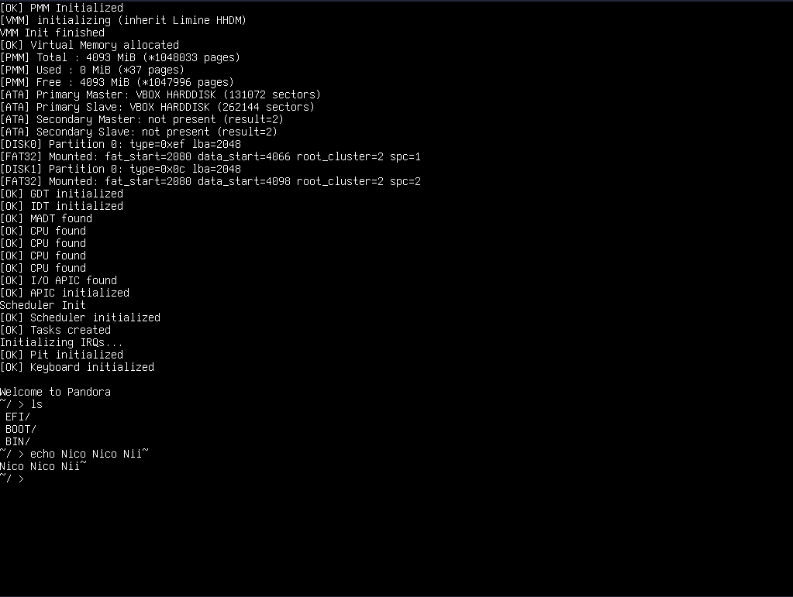

# Pandora OS




A modern 64-bit hobby operating system written in C++ focused on low-level systems programming, multitasking, and hardware abstraction.

## Table of Contents

* [Features](#features)

  * [Implemented](#implemented)
  * [In Progress](#in-progress)
  * [Planned](#planned)
* [Building Pandora OS](#building-pandora-os)

  * [Requirements](#requirements)
  * [Building the Cross Compiler](#building-the-cross-compiler)
* [Building the Kernel](#building-the-kernel)
  * [Build tools](#build-tools)
  * [Make Targets](#make-targets)
  * [Build Flags](#build-flags)
* [Running Pandora OS](#running-pandora-os)
  * [QEMU](#qemu)
  * [VirtualBox](#virtualbox)
  * [Bochs](#bochs)
* [Documentation](#documentation)
* [Contributing](#contributing)
* [Console Font](#console-font)
* [License](#license)


---

## Current Status

**Version:** `v0.1`
**Architecture:** `x86_64`
**Language:** `C/C++` and `Assembly`
**Boot Protocol:** `Limine`

---

# Why Pandora OS?

Pandora OS was created as a hobby and educational operating system project focused on learning low-level systems programming and kernel development.

The project serves as a hands-on environment for exploring:

* x86_64 architecture
* Boot protocols and early kernel initialization
* Memory management
* Hardware drivers
* Interrupts and multitasking
* Filesystems and executable formats
* Graphics and rendering systems

Rather than aiming to compete with existing operating systems, Pandora OS is designed as a long-term learning platform and experimental kernel architecture project.

The goal is to better understand how modern operating systems function internally by building components from the ground up.

---

## Features

### Implemented

* [x] 64-bit kernel
* [x] Limine bootloader support
* [x] Basic kernel build system
* [x] Cross-compiler toolchain scripts
* [x] FAT32 disk image generation
* [x] ISO image generation
* [x] Serial port driver
* [x] GDT
* [x] TSS
* [x] IDT
* [x] PIC/APIC
* [x] Interrupt handling
* [x] PS/2 Keyboard driver
* [x] Physical memory manager
* [x] Paging and virtual memory
* [x] Kernel heap allocator
* [x] Preemptive multitasking
* [x] Basic terminal / console
* [x] Filesystem support
* [x] User mode support
* [x] Syscall interface
* [x] Flat Binary executable loading

### In Progress
* [ ] ELF executable loading

### Planned

* [ ] Graphics subsystem
* [ ] Networking

# Building Pandora OS

## Requirements

### Toolchain Dependencies

To build the cross-compiler toolchain, install the following packages:

* Bison
* Flex
* GMP
* MPC
* MPFR
* Texinfo

More information, including package names for various Linux distributions, can be found on the OSDev Wiki:

* https://wiki.osdev.org/GCC_Cross-Compiler#Preparing_for_the_build

---

## Building the Cross Compiler

From the root project directory:

```bash
./toolchain.sh
```

This script will:

1. Download **binutils** and **GCC**
2. Configure the cross-compilation toolchain
3. Build the compiler
4. Install it into the `toolchain/` directory
5. Verify the compiler installation

### Toolchain Script Options

| Option     | Description                      |
| ---------- | -------------------------------- |
| `gcc`      | Build GCC only                   |
| `binutils` | Build binutils only              |
| `all`      | Build both GCC and binutils      |
| `parallel` | Enable parallel compilation jobs |
| `serial`   | Disable parallel compilation     |

Example:

```bash
./toolchain.sh all parallel
```

> By default, the script builds both GCC and binutils with parallel compilation disabled.

---

## Building the Kernel

### Build Tools

* NASM — assembler
* Make — build system

### Virtualization / Testing

* QEMU — debugging and testing
* VirtualBox — virtualization support

Official project links:

* NASM: https://github.com/netwide-assembler/nasm
* QEMU: https://github.com/qemu/qemu
* VirtualBox: https://www.virtualbox.org/

---

To compile the kernel:

```bash
make
```

The compiled kernel binary will be placed in:

```text
build/bin/
```

---

## Make Targets

| Command        | Description                          |
| -------------- | ------------------------------------ |
| `make`         | Build the kernel                     |
| `make disk`    | Create a FAT32 HDD image with Limine |
| `make iso`     | Create a bootable ISO image          |
| `make run_vb`  | Run Pandora OS in VirtualBox         |
| `make clean`   | Clean build artifacts                |
| `make doxygen` | Generate documentation               |

---

## Build Flags

| Flag                     | Description                         |
| ------------------------ | ----------------------------------- |
| `-DSERIAL_LOOPBACK_TEST` | Enable serial port loopback testing |

> There are known issues with VirtualBox and Serial Loopback Testing not working if enabled.

---

# Running Pandora OS

## QEMU

Example:

```bash
qemu-system-x86_64 -cdrom pandora.iso
```

## VirtualBox

Create a virtual machine named:

```text
PandoraOS
```

And set the storage to either the `build/bin/pandora.hdd` or `build/bin/pandora.iso`.

Then use:

```bash
make run_vb
```

## Bochs

A bochsrc file is included. You will need to modify the locations to your locations of `BIOS-bochs-latest` and `VGABIOS-lgpl-latest`.

Example:

```text
bochs -q
```


---

# Documentation

Doxygen documentation can be generated using:

```bash
make doxygen
```

Generated documentation will be placed inside the `docs` directory.

---

# Contributing

Contributions, suggestions, and issue reports are welcome.

If you would like to contribute:

1. Fork the repository
2. Create a feature branch
3. Commit your changes
4. Open a pull request

---

# Console Font

Pandora OS currently uses console fonts from:

* https://www.zap.org.au/projects/console-fonts-zap/

---

# License

Pandora OS is licensed under the GNU General Public License v2.0 (GPL-2.0).

This project is open-source and intended for educational, hobbyist, and experimental operating system development.
